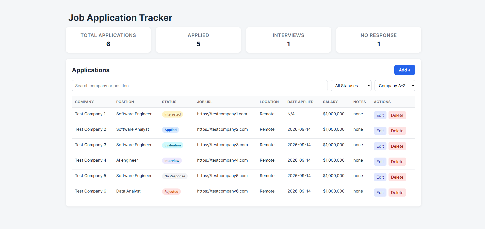

# JOB APPLICATION TRACKER

A full-stack web application for organizing and tracking job applications throughout the job search process. The application provides a centralized place to manage prospective opportunities, track submitted applications through different stages, and quickly find relevant applications using search, filtering, and sorting tools.

This project was built with React and TypeScript on the frontend, a Node.js and Express REST API on the backend, and PostgreSQL with Prisma ORM for persistent data storage.

## demo screenshot



## Features

- **Application Management**: Add, edit, and delete job applications with information including company, position, status, location, date applied, job URL, salary, and notes.
- **Application Status Tracking**: Track opportunities through statuses including Interested, Applied, Evaluation, Interview, Rejected, and No Response.
- **Dashboard Statistics**: View counts for total opportunities, submitted applications, interviews, and applications with no response.
- **Search**: Search applications by company or position
- **Status Filtering**: Filter the application table to display applications at a specific stage of the process.
- **Sorting**: Sort applications by application date or company name
- **Persistent Storage**: Application data is stored in PostgreSQL and remains available across browser and server sessions
- **Add/Edit Modal**: Create and modify applications through a reusable form displayed in a modal interface.
- **Input Validation**: Validate application data on both the frontend and backend before storing it in the database.
- **REST API**: Perform persistent CRUD operations through an Express API connected to PostgreSQL using Prisma ORM.

## Tech Stack

### Frontend

- **React**: Component based user interface
- **TypeScript**: Static typing and shared application data structures
- **Vite**: Frontend developement and build tooling
- **CSS**: Custom applicaiton styling and responsive layout

### Backend

- **Node.js**: JavaScript runtime for the server
- **Express**: REST API and HTTP request handling
- **TypeScript**: Type-safe backend developement

### Database

- **PostgreSQL**: Relational database for persistent application data
- **Prisma ORM**: Database schema management and application-level database access

### Developement tools

- **Git & Github**: Version control and source code management
- **npm**: Package and dependency management

## Project Structure

The project separates the React frontend from the Express backend. The backend is further divided into routes, controllers, validation, and database configuration.

```text
JobApplicationTrackerWebsite/
├── public/
│   └── favicon.svg
│
├── server/
│   ├── prisma/
│   │   ├── migrations/
│   │   └── schema.prisma
│   │
│   ├── src/
│   │   ├── controllers/
│   │   │   └── applicationController.ts
│   │   ├── routes/
│   │   │   └── applicationRoutes.ts
│   │   ├── validation/
│   │   │   └── applicationValidation.ts
│   │   ├── prisma.ts
│   │   └── server.ts
│   │
│   ├── .env.example
│   ├── .gitignore
│   ├── package-lock.json
│   ├── package.json
│   ├── prisma7.config.ts
│   └── tsconfig.json
│
├── src/
│   ├── components/
│   │   ├── ApplicationForm.tsx
│   │   └── ApplicationTable.tsx
│   ├── App.tsx
│   ├── index.css
│   ├── main.tsx
│   ├── types.ts
│   └── vite-env.d.ts
│
├── .gitignore
├── index.html
├── package-lock.json
├── package.json
├── tsconfig.json
├── tsconfig.node.json
├── vite.config.ts
```

### Frontend

The `src/` directory contains the React frontend. `App.tsx` manages application data, dashboard statistics, search/filter/sort state, and the add/edit modal. Reusable UI functionality is separated into components for the application form and application table, while `types.ts` defines the shared TypeScript data structures used throughout the frontend.

### Backend

The `server/` directory contains the Express REST API and database integration. Backend responsibilities are separated into:

- **Controllers**: Handle HTTP requests and perform CRUD operations using Prisma.
- **Routes**: Map API endpoints to the controller functions.
- **Validation**: Validate incoming application data and enforce application-specific rules before performing database operations.
- **Prisma configuration** — Creates the Prisma client and PostgreSQL connection used by the controllers.

### Database

`server/prisma/schema.prisma` defines the PostgreSQL database model used to store job applications. Prisma provides the interface between the Express backend and PostgreSQL, including database queries and schema migrations.

## Getting Started

Follow these steps to get the project running locally.

## Prerequisites

Before getting started, make sure you have the following installed:

- [Node.js](https://nodejs.org/) and npm
- [PostgreSQL](https://www.postgresql.org/)
- [Git](https://git-scm.com/)

### 1. Clone the Repository

```bash
git clone https://github.com/JohnBilbrey-Projects/JobApplicationTrackerWebsite.git
cd JobApplicationTrackerWebsite
```

### 2. Install Frontend Dependencies

From the project root:

```bash
npm install
```

### 3. Install Backend Dependencies

Navigate to the server directory and install the backend dependencies:

```bash
cd server
npm install
```

### 4. Create the PostgreSQL Database

Make sure PostgreSQL is running, then create a database for the application:

```sql
CREATE DATABASE job_application_tracker;
```

I used PgAdmin to create the database

### 5. Configure Environment Variables

Inside the `server/` directory, create a `.env` file based on the included `.env.example` file.

Add your PostgreSQL connection string.

```env
DATABASE_URL="{your connection string}"
```

### 6. Set Up Prisma

From the `server/` directory, apply the existing database migrations:

```bash
npx prisma migrate deploy
```

Then generate the Prisma client:

```bash
npx prisma generate
```

### 7. Start the Backend

From the `server/` directory:

```bash
npm run dev
```

The API will run at:

```text
http://localhost:3000
```

You can verify that the server is running by visiting the address above. It should show:

```text
API is running...
```

### 8. Start the Frontend

Open a second terminal, navigate to the project root, and run:

```bash
npm run dev
```

Vite will display the local URL for the frontend.

Open the URL in your browser to use the application.

## Future Improvements

this section may be updated further as I think of new features to add.

- Add "Application Viewed" status
- Additional dashboard analytics and visualizations
- follow up reminders
- more advanced filtering and sorting options
- automated testing

## Author

**John Bilbrey**

Computer Science graduate from Indiana University with a specialization in Artificial Intelligence.

- GitHub: [JohnBilbrey-Projects](https://github.com/JohnBilbrey-Projects)
